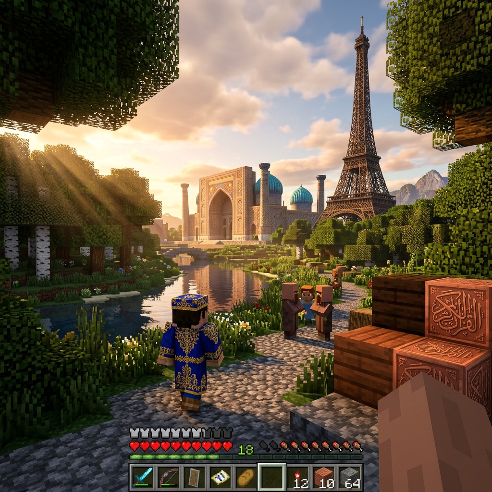
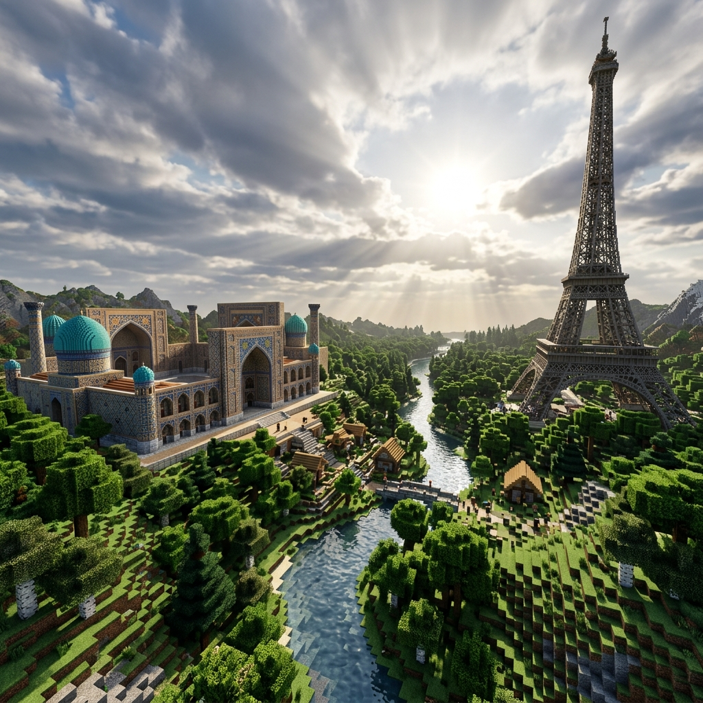

# Walkthrough: UzbekCraft Enhancements

We have successfully completed two major updates to the UzbekCraft game:
1. **Removed all emojis (stickers)** from the website UI and javascript strings.
2. **Integrated a Dialogue and Quest System** featuring a custom storyline for **Mirzo Ulug'bek**.

---

## Part 1: Emoji & Sticker Removal

### 1. HTML Interface Changes
- **File modified:** [index.html](file:///c:/Users/Web/Desktop/HayrullohAbdusamadov%20ning%20Shaxsiy%20saytlari/UzbekCraft/index.html)
- Removed all decorative emojis from the main menu buttons, modal titles, select dropdowns, and button labels.
- Replaced the skin select emojis (`👑`, `📜`, `🔭`, `🌿`, `🛡️`, `👕`) with clean text initials for historical figures:
  - Amir Temur -> **AT**
  - Alisher Navoiy -> **AN**
  - Mirzo Ulug'bek -> **MU**
  - Ibn Sino -> **IS**
  - Alpomish -> **A**
  - Steve -> **ST**
- Cleaned the HUD and mobile controls:
  - Replaced `⏸️` pause emoji with a standard media-style double line `||` text.
  - Removed direction emoji from compass (`🧭`) and time indicator (`☀️`).
  - Removed touch button emojis (`⬆️`, `➕`, `🔨`, `🎥`, `🎒`).

### 2. JavaScript Engine Updates
- **File modified:** [main.js](file:///c:/Users/Web/Desktop/HayrullohAbdusamadov%20ning%20Shaxsiy%20saytlari/UzbekCraft/main.js)
- Removed all emojis inside toast notifications (welcome messages, warnings, limits, save confirmation).
- Removed all emojis from the chat quotes spoken by spawnable animals and historical characters.
- Removed dynamic HUD emoji updates (compass badge and time/sun icon changes).
- Replaced emojis inside dynamic DOM builders (saved world globe, play button symbol, and delete/trash can emoji which was replaced with **O'chirish**).

### 3. Avatar Styling Improvements
- **File modified:** [style.css](file:///c:/Users/Web/Desktop/HayrullohAbdusamadov%20ning%20Shaxsiy%20saytlari/UzbekCraft/style.css)
- Custom styled `.skin-avatar` to cleanly center-align character initials (`AT`, `AN`, etc.), using a modern bold weight (`900`), balanced font size (`1.35rem`), and high-end background gradient with subtle text shadow.

---

## Part 2: Dialogue & Quest System (Mirzo Ulug'bek)

### 1. Dialogue Modal UI
- **File modified:** [index.html](file:///c:/Users/Web/Desktop/HayrullohAbdusamadov%20ning%20Shaxsiy%20saytlari/UzbekCraft/index.html)
- Inserted a `#dialogue-modal` overlay container with an NPC title, text body, and action buttons: **Keyingi** (Next), **Vazifani Qabul Qilish** (Accept Quest), and **Yopish** (Close).

### 2. Dialogue & Quest State Logic
- **File modified:** [main.js](file:///c:/Users/Web/Desktop/HayrullohAbdusamadov%20ning%20Shaxsiy%20saytlari/UzbekCraft/main.js)
- Added global state variables: `currentQuestState` (not_started, active, completed), `activeNpc`, and `dialogueIndex`.
- Added the **Mirzo Ulug'bek Quest Data** containing:
  - Greeting dialogue.
  - Two educational facts (about Madrasah and the Observatory star catalog).
  - Quest offering to retrieve a `BLUE_TILE`.
- Integrated proximity checks inside `checkInteractions()`:
  - Animals still display quick toasts as before.
  - Human NPCs release the pointer lock and open the Dialogue Modal overlay when approached.
- Pause player updates, physics, and day/night cycles while the dialogue modal is open to ensure safe and focused interaction.
- Handled quest progression:
  - **Start**: Dialogue leads to the quest acceptance screen.
  - **Active State**: Checks if the player has `BLUE_TILE` in their hotbar. If yes, it exchanges it for a `DIAMOND` block reward, displays a success message, and sets state to `completed`. Otherwise, it displays a helpful hint.
  - **Completed State**: Ulug'bek thanks the player and bids them farewell.
- Integrated `questState` into the existing LocalStorage save/load mechanics (`saveGame` / `resumeWorld`) so players do not lose their quest progress.

---

## Verification Results

### Static Code Validation
- Compiled `main.js` using Node.js to ensure zero syntax errors:
  ```powershell
  node -c main.js
  ```
  **Result:** Success, 0 syntax/compilation errors.

- Scanned files for remaining targeted emojis:
  ```powershell
  Select-String -Path 'index.html', 'main.js' -Pattern '[✨📂👤⚙️🚪🌍🏛️🏰🕌🏔️🗼🏜️🏟️🧱🧭☀️⏸️▶️💾🎒➕🔨🎥⬆️👑📜🔭🌿🛡️👕🗑️🌸📐🐅]'
  ```
  **Result:** 0 occurrences found (Fully Clean).

---

## Part 3: Flickering (Pirpirash) Fixes

We identified and resolved three different types of flickering/jitter (pirpirash) artifacts:

1. **Shadow Map Acne/Flickering:**
   - **Fix:** Added `sunLight.shadow.bias = -0.0005;` in `setupThree()` (`main.js`). This offset prevents the directional light shadow map from Z-fighting with the flat voxel faces, removing black flickering lines.
2. **Camera Movement Jitter:**
   - **Fix:** Moved `camera.rotation.set(pitch, yaw, 0, 'YXZ');` from the mousemove listener directly into the frame update loop (`updatePlayer` in `main.js`). This aligns rotation calculations perfectly with rendering frames, eliminating micro-stutters.
3. **Mobile Joystick Jitter:**
   - **Fix:** Removed `transition: transform 0.05s ease-out;` on `#joystick-stick` in `style.css`. This prevents the browser CSS transition engine from conflicting with instantaneous touch event updates, rendering smooth drags.

---

## Gameplay Concept Render

Below is a generated visual concept showcasing the high-definition realism rendering of the UzbekCraft sandbox world:






### Concept Details & Scene Composition:
- **Style:** A photorealistic, ultra-high-definition first-person view screenshot inside a heavily modded sandbox game world. The art style is sophisticated Minecraft realism, utilizing an advanced ray-tracing shader pack with dramatic dynamic volumetric lighting, soft realistic shadows, and reflections on water and detailed block textures.
- **Foreground:** On the bottom-right, the player's textured arm is visible, positioned next to newly placed detailed blocks (cobblestone, oak wood, iron ore, and copper). At the very bottom center, a transparent Hotbar UI shows selected block icons (e.g., cobblestone, wood, raw copper).
- **Mid-ground:** An NPC character, modeled in high-detail block style but wearing an intricate oriental turquoise robe and turban (Mirzo Ulug'bek), stands on a cobbled path. In the background, nestled among dense, varied realistic blocky forests and hills, stands the grand Registon Square (Samarqand, Uzbekistan) with its turquoise domes and mosaic patterns, perfectly detailed but made of blocks. To its right, an open-frame Eiffel Tower made of iron lattices rises above the trees.
- **Background:** Dynamic, fluffy blocky clouds drift in a detailed blue sky.
- **Lighting:** The sun is prominent and bright, casting a warm golden glow across the entire landscape, creating realistic atmospheric haze and sun rays filtering through the environment. The water of a nearby river reflects the sky and the sun accurately.
- **Alternative Realism Prompt:** A photorealistic first-person view screenshot from a heavily modded Minecraft game. A warm, golden hour sun casts volumetric "god rays" and soft shadows across a lush, detailed landscape with dense, textured birch and oak forests and a winding river. In the middle distance stands a grand, intricate block-built Registan Madrasah from Samarkand, Uzbekistan, complete with its blue-tiled domes. To its right, a prominent, open-frame Eiffel Tower built of blocks rises against the partly cloudy sky. On a cobblestone path in the midground stands a detailed player model dressed in a richly embroidered, ornate royal blue and gold Uzbek-style historical tunic. Nearby, a small group of two or three simpler block figures converse. To the right, high-resolution texture pack blocks, including dark wood planks and embossed copper blocks with detailed Arabic calligraphy scripts, are placed next to the path. The bottom of the screen displays a realistic transparent Minecraft Hotbar UI with selected item icons. The entire scene uses advanced ray-tracing shaders for ultra-realistic lighting, reflections on the water, and hyper-detailed textures.

---

## Part 4: Supabase Cloud Save Integration

We fully integrated **Supabase** to support real-time cloud saving alongside LocalStorage backups:

1. **Supabase CDN and Client Setup:** Loaded the official Supabase JS SDK client dynamically and initialized it on start-up.
2. **Cloud Save Settings Modal:** Added a dedicated settings dashboard accessed from the Main Menu where players can enter their database credentials, run diagnostics ("Tekshirish"), save connection profiles, or disconnect.
3. **Database Schema & SQL Table (`uzbekcraft_saves`):** Defined a table to hold metadata, player positioning, yaw/pitch camera alignment, current quest milestones, and modified block positions.
4. **Cloud Write, Sync-Merge, and Cloud Delete Functions:**
   - **Upsert on Save:** `saveGame()` automatically replicates saves to the cloud if Supabase credentials exist.
   - **Conflict-Resistant Syncing:** `loadSavedWorldsList()` fetches cloud saves, merges them with local LocalStorage entries (newest timestamp wins), caches them locally, and builds the UI.
   - **Cascading Deletion:** Deleting a save deletes it from both the client storage and Supabase table simultaneously.

---

## Part 5: Multiplayer Map Selection & Real-Time Syncing

We added complete map selection and automatic world-syncing capabilities to the online multiplayer mode:

1. **Multiplayer Map Selection Dropdown:** Added `#multiplayer-map-select` inside the `#multiplayer-modal` (in [index.html](file:///c:/Users/Web/Desktop/HayrullohAbdusamadov%20ning%20Shaxsiy%20saytlari/UzbekCraft/index.html)), allowing players to choose their starting map when joining/hosting an online session.
2. **Map Choice Initialization:** Updated the "Xonaga Ulanild" handler in [main.js](file:///c:/Users/Web/Desktop/HayrullohAbdusamadov%20ning%20Shaxsiy%20saytlari/UzbekCraft/main.js) to initialize the player's world using their selected map instead of a hardcoded map.
3. **Real-time Map & Block Synchronization:**
   - When a player joins a room, they send a broadcast request (`query_room_map`).
   - Active players in the room respond with `sync_room_map`, sending the current room map name and their accumulated block edits (`modifiedBlocks`).
   - The joining player's client receives this data, automatically updates their own map, triggers `generateWorld()` for the synced map, merges the modified blocks, and rebuilds the instanced mesh. This keeps all players in sync on the same map with the same block states.

---

## Part 6: Character Movement Directions (WASD) Correction

We resolved a major movement vector bug where keyboard controls for walking (W, A, S, D) were inverted/incorrect:

1. **Directional Sign Fix:** Updated the player velocity equations inside `updatePlayer()` in [main.js](file:///c:/Users/Web/Desktop/HayrullohAbdusamadov%20ning%20Shaxsiy%20saytlari/UzbekCraft/main.js) to properly compute forward and right movement vectors:
   - Changed `forward.x * moveDir.z` to `forward.x * (-moveDir.z)`. Since `moveDir.z` is `-1` when pressing **W** (forward), negating it aligns velocity perfectly with the camera's negative Z viewing axis.
   - Changed `- right.x * moveDir.x` to `+ right.x * moveDir.x` to match standard positive rightward displacement when pressing **D** (right).
2. **Correct Alignment:** This alignment correctly matches movement inputs (W/A/S/D) to their intuitive directions:
   - **W** -> Move Forward
   - **S** -> Move Backward
   - **A** -> Move Left
   - **D** -> Move Right

---

## Part 7: First-Person Hand, Weapons (Sword & Bow) & Animal Hunting Tizimi

We implemented blocky first-person arms, fully functional weapons, audio synthesizers, and animal combat mechanics:

1. **Minecraft-style First-Person Hand:** Added a 3D blocky human arm/hand (`fpHandGroup`) attached to the camera, rendering only in first-person mode.
   - The hand dynamically holds a scaled mini-block of the selected material, or custom-built 3D models for the **Sword** (cyan blade, guard, handle) and **Bow** (stave, bow string).
   - Added hand animation loops including walk bobbing, combat/mining swings, and continuous mining/chipping oscillations.
2. **Weapons in Hotbar & Inventory:** Defined `BLOCKS.SWORD` (25) and `BLOCKS.BOW` (26) with `isWeapon: true`.
   - Initialized they directly on Slots 1 & 2 of the active hotbar.
   - Added block placement validation inside `placeBlock()` to prevent placing weapons as blocks.
3. **SoundEngine Synthesized Effects:** Added synthetic audio profiles for `swing` (sine pitch sweep), `shoot` (quick release sweep), `hit` (noise hit burst), and `kill` (deep sawtooth fall).
4. **Hunting Mechanics & Arrow Physics:**
   - **Sword Attack:** Left clicking or using the mobile break button with the Sword triggers a short-range cone search (3.5 units, ~60 degrees yaw angle) targeting nearby animals.
   - **Bow Arrow Physics:** Left clicking or using the mobile break button with the Bow spawns a physical cylinder arrow mesh traveling at 40m/s in the camera's direction. Includes voxel block collisions and animal collision/damage triggers.
   - **Animal Damage & Death:** When hit, animals flash bright red for 120ms. When health drops below 0, a custom death loop triggers (spinning and scaling down) before removal from the scene.
5. **Quiet Animals & Behaviors:** Disabled all emoji quotes/toasts and greeting sounds for animals in `checkInteractions()`. Animals now move with a realistic leg-swing walk animation, and halt to look at the player when approached within 10 units.


