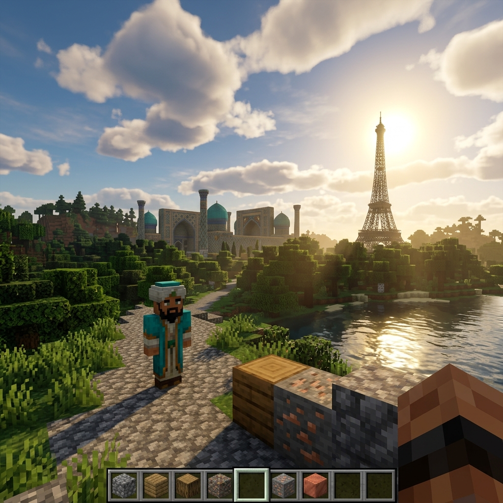

# Walkthrough: UzbekCraft Enhancements

We have successfully completed two major updates to the UzbekCraft game:
1. **Removed all emojis (stickers)** from the website UI and javascript strings.
2. **Integrated a Dialogue and Quest System** featuring a custom storyline for **Mirzo Ulug'bek**.

---

## Part 1: Emoji & Sticker Removal

### 1. HTML Interface Changes
- **File modified:** [index.html](file:///c:/Users/Web/Desktop/HayrullohAbdusamadov%20ning%20Shaxsiy%20saytlari/UzbekCraft/index.html)
- Removed all decorative emojis from the main menu buttons, modal titles, select dropdowns, and button labels.
- Replaced the skin select emojis (`👑`, `📜`, `🔭`, `🌿`, `🛡️`, `👕`) with clean text initials for historical figures:
  - Amir Temur -> **AT**
  - Alisher Navoiy -> **AN**
  - Mirzo Ulug'bek -> **MU**
  - Ibn Sino -> **IS**
  - Alpomish -> **A**
  - Steve -> **ST**
- Cleaned the HUD and mobile controls:
  - Replaced `⏸️` pause emoji with a standard media-style double line `||` text.
  - Removed direction emoji from compass (`🧭`) and time indicator (`☀️`).
  - Removed touch button emojis (`⬆️`, `➕`, `🔨`, `🎥`, `🎒`).

### 2. JavaScript Engine Updates
- **File modified:** [main.js](file:///c:/Users/Web/Desktop/HayrullohAbdusamadov%20ning%20Shaxsiy%20saytlari/UzbekCraft/main.js)
- Removed all emojis inside toast notifications (welcome messages, warnings, limits, save confirmation).
- Removed all emojis from the chat quotes spoken by spawnable animals and historical characters.
- Removed dynamic HUD emoji updates (compass badge and time/sun icon changes).
- Replaced emojis inside dynamic DOM builders (saved world globe, play button symbol, and delete/trash can emoji which was replaced with **O'chirish**).

### 3. Avatar Styling Improvements
- **File modified:** [style.css](file:///c:/Users/Web/Desktop/HayrullohAbdusamadov%20ning%20Shaxsiy%20saytlari/UzbekCraft/style.css)
- Custom styled `.skin-avatar` to cleanly center-align character initials (`AT`, `AN`, etc.), using a modern bold weight (`900`), balanced font size (`1.35rem`), and high-end background gradient with subtle text shadow.

---

## Part 2: Dialogue & Quest System (Mirzo Ulug'bek)

### 1. Dialogue Modal UI
- **File modified:** [index.html](file:///c:/Users/Web/Desktop/HayrullohAbdusamadov%20ning%20Shaxsiy%20saytlari/UzbekCraft/index.html)
- Inserted a `#dialogue-modal` overlay container with an NPC title, text body, and action buttons: **Keyingi** (Next), **Vazifani Qabul Qilish** (Accept Quest), and **Yopish** (Close).

### 2. Dialogue & Quest State Logic
- **File modified:** [main.js](file:///c:/Users/Web/Desktop/HayrullohAbdusamadov%20ning%20Shaxsiy%20saytlari/UzbekCraft/main.js)
- Added global state variables: `currentQuestState` (not_started, active, completed), `activeNpc`, and `dialogueIndex`.
- Added the **Mirzo Ulug'bek Quest Data** containing:
  - Greeting dialogue.
  - Two educational facts (about Madrasah and the Observatory star catalog).
  - Quest offering to retrieve a `BLUE_TILE`.
- Integrated proximity checks inside `checkInteractions()`:
  - Animals still display quick toasts as before.
  - Human NPCs release the pointer lock and open the Dialogue Modal overlay when approached.
- Pause player updates, physics, and day/night cycles while the dialogue modal is open to ensure safe and focused interaction.
- Handled quest progression:
  - **Start**: Dialogue leads to the quest acceptance screen.
  - **Active State**: Checks if the player has `BLUE_TILE` in their hotbar. If yes, it exchanges it for a `DIAMOND` block reward, displays a success message, and sets state to `completed`. Otherwise, it displays a helpful hint.
  - **Completed State**: Ulug'bek thanks the player and bids them farewell.
- Integrated `questState` into the existing LocalStorage save/load mechanics (`saveGame` / `resumeWorld`) so players do not lose their quest progress.

---

## Verification Results

### Static Code Validation
- Compiled `main.js` using Node.js to ensure zero syntax errors:
  ```powershell
  node -c main.js
  ```
  **Result:** Success, 0 syntax/compilation errors.

- Scanned files for remaining targeted emojis:
  ```powershell
  Select-String -Path 'index.html', 'main.js' -Pattern '[✨📂👤⚙️🚪🌍🏛️🏰🕌🏔️🗼🏜️🏟️🧱🧭☀️⏸️▶️💾🎒➕🔨🎥⬆️👑📜🔭🌿🛡️👕🗑️🌸📐🐅]'
  ```
  **Result:** 0 occurrences found (Fully Clean).

---

## Part 3: Flickering (Pirpirash) Fixes

We identified and resolved three different types of flickering/jitter (pirpirash) artifacts:

1. **Shadow Map Acne/Flickering:**
   - **Fix:** Added `sunLight.shadow.bias = -0.0005;` in `setupThree()` (`main.js`). This offset prevents the directional light shadow map from Z-fighting with the flat voxel faces, removing black flickering lines.
2. **Camera Movement Jitter:**
   - **Fix:** Moved `camera.rotation.set(pitch, yaw, 0, 'YXZ');` from the mousemove listener directly into the frame update loop (`updatePlayer` in `main.js`). This aligns rotation calculations perfectly with rendering frames, eliminating micro-stutters.
3. **Mobile Joystick Jitter:**
   - **Fix:** Removed `transition: transform 0.05s ease-out;` on `#joystick-stick` in `style.css`. This prevents the browser CSS transition engine from conflicting with instantaneous touch event updates, rendering smooth drags.

---

## Gameplay Concept Render

Below is a generated visual concept showcasing the high-definition realism rendering of the UzbekCraft sandbox world:



### Concept Details & Scene Composition:
- **Style:** A photorealistic, ultra-high-definition first-person view screenshot inside a heavily modded sandbox game world. The art style is sophisticated Minecraft realism, utilizing an advanced ray-tracing shader pack with dramatic dynamic volumetric lighting, soft realistic shadows, and reflections on water and detailed block textures.
- **Foreground:** On the bottom-right, the player's textured arm is visible, positioned next to newly placed detailed blocks (cobblestone, oak wood, iron ore, and copper). At the very bottom center, a transparent Hotbar UI shows selected block icons (e.g., cobblestone, wood, raw copper).
- **Mid-ground:** An NPC character, modeled in high-detail block style but wearing an intricate oriental turquoise robe and turban (Mirzo Ulug'bek), stands on a cobbled path. In the background, nestled among dense, varied realistic blocky forests and hills, stands the grand Registon Square (Samarqand, Uzbekistan) with its turquoise domes and mosaic patterns, perfectly detailed but made of blocks. To its right, an open-frame Eiffel Tower made of iron lattices rises above the trees.
- **Background:** Dynamic, fluffy blocky clouds drift in a detailed blue sky.
- **Lighting:** The sun is prominent and bright, casting a warm golden glow across the entire landscape, creating realistic atmospheric haze and sun rays filtering through the environment. The water of a nearby river reflects the sky and the sun accurately.

